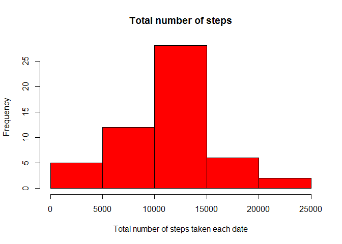
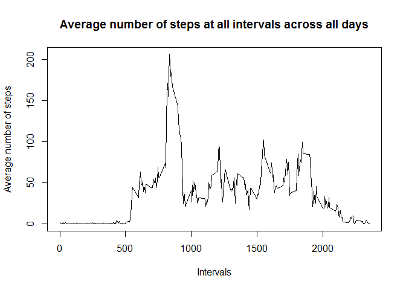
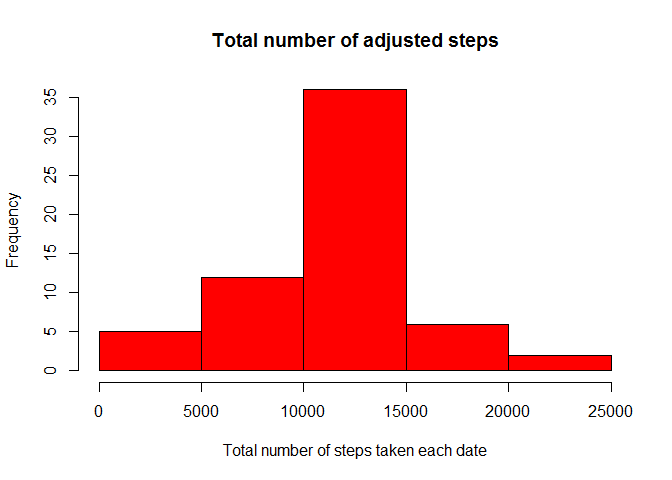

Reproducible Research: Peer Assessment 1
=======================================================================================

This report contains the answers to the questions raised in the first Peer review assessment set as part of the Reproducible Research course.

The following R code is loading in the required libraries.


```r
library(dplyr)
```

```
## 
## Attaching package: 'dplyr'
## 
## The following object is masked from 'package:stats':
## 
##     filter
## 
## The following objects are masked from 'package:base':
## 
##     intersect, setdiff, setequal, union
```

```r
library(tidyr)
library(datasets)
library(lattice)
```
##Loading and preprocessing the data
The first thing that needs to be done is to load the data and remove the empty values

```r
data<-read.csv("activity.csv",stringsAsFactors=FALSE)
nonadata<-na.omit(data)
```
##What is mean total number of steps taken per day?

The following code creates a new dataset containing only the total number of steps per day and the respectful date.

```r
totalsteps<-nonadata %>%
  group_by(date) %>%
  mutate(total=sum(steps)) %>%
  select(date,total) %>%
  unique
```
The following histogram represents the total number of steps taken each date

```r
hist(totalsteps$total,xlab="Total number of steps taken each date",main="Total number of steps", col="red")
```

 

The following is the calculation of the mean and median of the total number of steps taken per day.

```r
mean(totalsteps$total)
```

```
## [1] 10766.19
```

```r
median(totalsteps$total)
```

```
## [1] 10765
```

##What is the average daily activity pattern?

To calculate the average daily activity pattern, first a new dataset is created containing the average of the number of steps in the intervals across all days.
 

```r
avgsteps<-nonadata %>%
  group_by(interval) %>%
  mutate(themean=mean(steps)) %>%
  select(interval,themean) %>%
  unique
```
The following plot represents the average number of steps at all intervals across all days.


```r
with(avgsteps,plot(interval,themean,main="Average number of steps at all intervals across all days",xlab="Intervals",ylab="Average number of steps",type="n"))
with(avgsteps,lines(interval,themean,type="l"))
```

 

```r
foundinterval<-avgsteps[grep(max(avgsteps$themean),avgsteps$themean),"interval"]
```

The interval that has the maximum average number of steps of all intervals across all days is **835**.


##Imputing missing values

```r
totalempty<-sum(is.na(data$steps))
```
The total count of empty values is **2304**.   
The following dataset has the same values as the original, apart from the missing values in the steps variable.   
All missing values are replaced with the average value of the number of steps in that interval across all days.   
Since the number of steps changes through out the day I think the best approximation of missing value is the average of the value for the same period in the other days. 


```r
filleddata<-merge(avgsteps,data,by="interval")
for (i in 1:nrow(filleddata)) {
	if (is.na(filleddata[i,"steps"])) {
		filleddata[i,"steps"]<-filleddata[i,"themean"]
	} 
}
```
The following dataset has the total number of steps per day.

```r
totalfullsteps<-filleddata %>%
  group_by(date) %>%
  mutate(total=sum(steps)) %>%
  select(date,total) %>%
  unique
```
The distribution of total number of steps through out the days, with the adjusted - filled in values is shown below:


```r
hist(totalfullsteps$total,xlab="Total number of steps taken each date",main="Total number of adjusted steps", col="red")
```

 
  
The adjusting of the values lead to increased frequency of the average total number of steps taken.
  
The mean and the median of the adjusted total number of steps are as follows:

```r
mean(totalfullsteps$total)
```

```
## [1] 10766.19
```

```r
median(totalfullsteps$total)
```

```
## [1] 10766.19
```
  
The adjusting of the values brought the mean and median to the same value.

##Are there differences in activity patterns between weekdays and weekends?

In order to answer this question, the data needs to be additionally processed 
with adding a column to identify the days as Weekday or Weekend, depending of which day of the week it is.


```r
addweekday<-filleddata %>%
  mutate(theday=weekdays(as.Date(date)))

for (i in 1:nrow(addweekday)) {
	if (addweekday[i,"theday"] %in% c("Saturday","Sunday")) {
		addweekday[i,"theday"]<-"weekend"
	} else {
		addweekday[i,"theday"]<-"weekday"
	}
}
```

The following dataset is used to calculate the average number of steps taken, averaged across all weekday days or weekend days.


```r
totalweeksteps<-addweekday %>%
  group_by(theday,interval) %>%
  mutate(average=mean(steps)) %>%
  select(theday,interval,average) %>%
  unique
```
  
The difference between the average number of steps taken throughout the day on weekdays and the weekends are shown below:


```r
xyplot(average ~ interval | theday, data = totalweeksteps, layout = c(1, 2), type="l",xlab="Interval",ylab="Number of steps")
```

 
